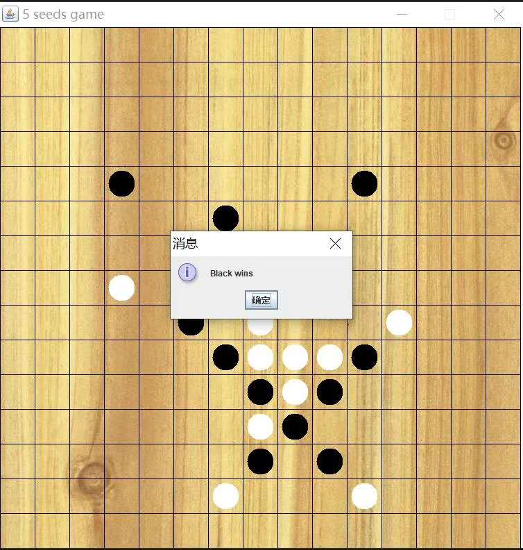
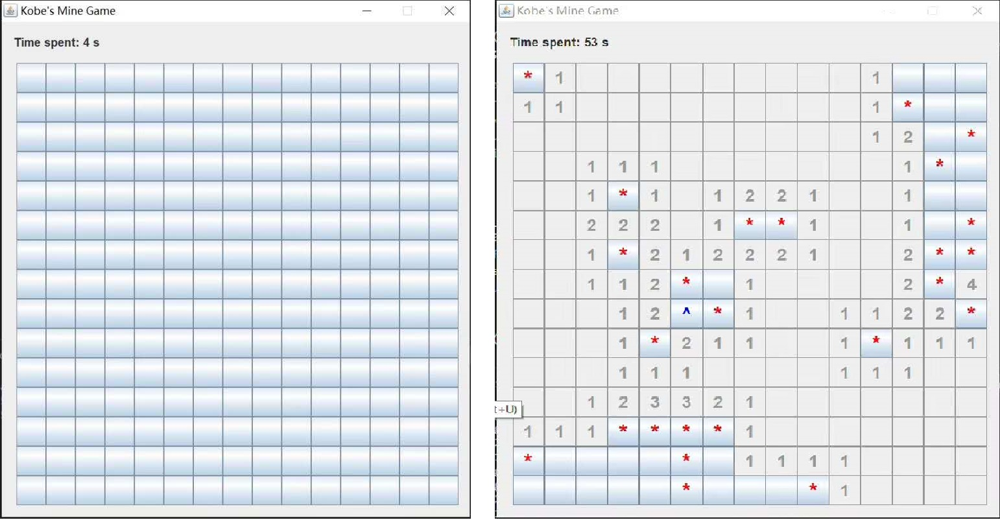
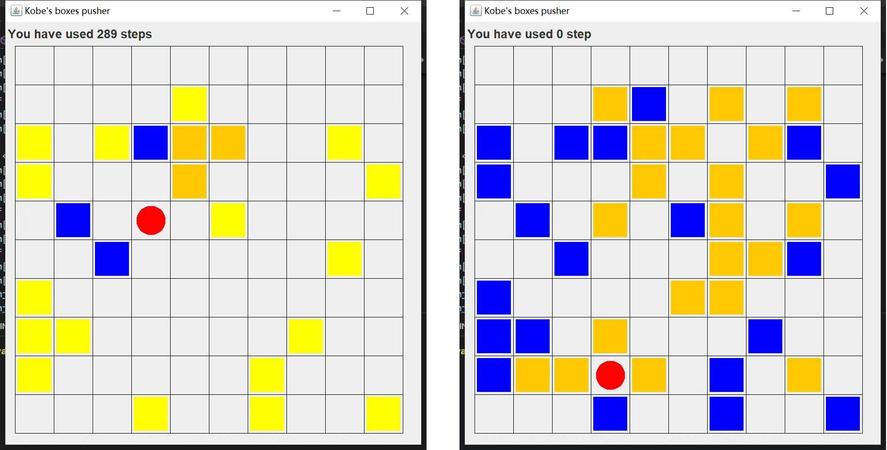
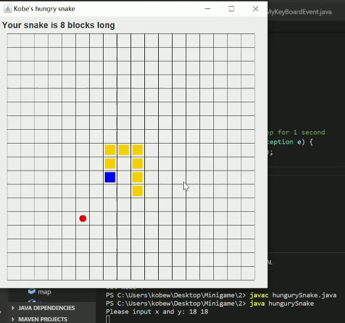
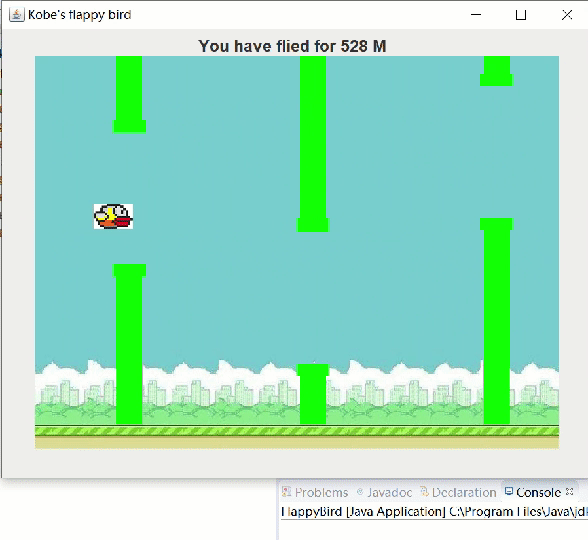

# Mini-Game-in-Java

## Description

Several mini games written in Java using ***swing*** and ***JavaFX*** as graphical library.

----

## **Gomoku**

### Screen Shot

### Movement
Mouse click.

----

## **Mine cleaner**

### Screen Shot

### Movement
Mouse click.

----

## **Push boxes**

### Screen Shot

### Movement
'W','A','S' and 'D'.

----

## Hungry snake

### Screen Shot

### Movement
'W','A','S' and 'D'.

----

## Flappy bird

### Screen Shot

### Movement
Space key.